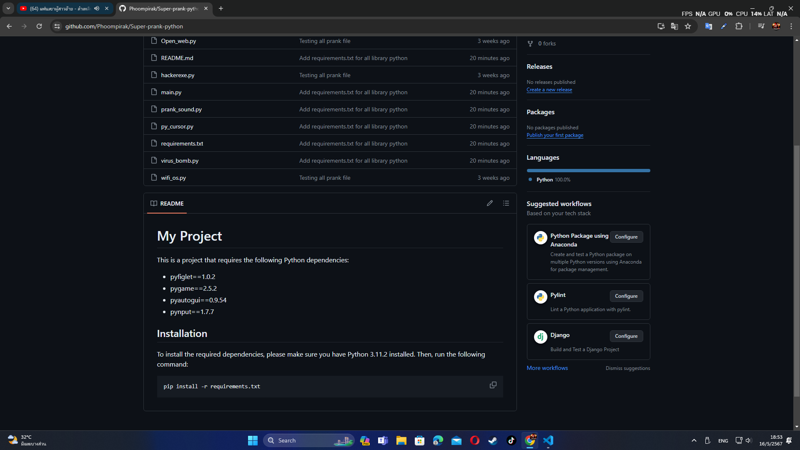
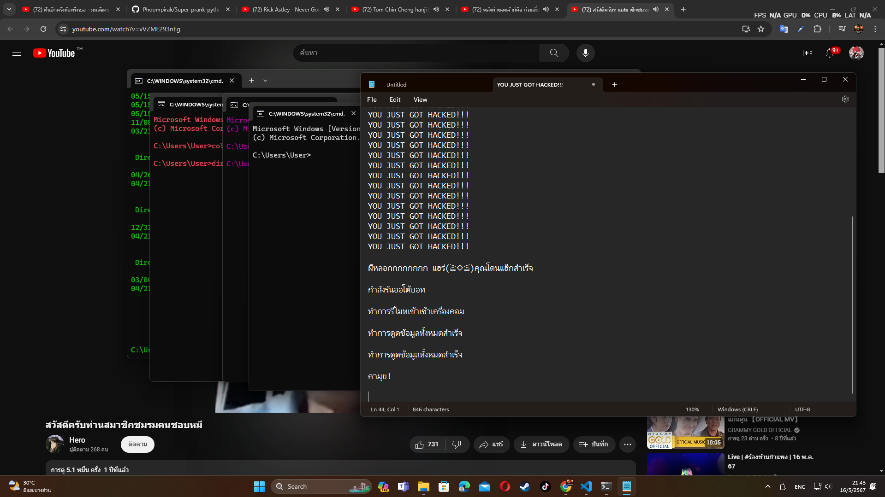

# My Project

*This is a project that requires the following Python dependencies*:
- pyfiglet==1.0.2
- pygame==2.5.2
- pyautogui==0.9.54
- pynput==1.7.7
- pyinstaller==6.6.0

## Installation

To install the required dependencies, please make sure you have Python 3.11.2 installed. Then, run the following command:

```bash
pip install -r requirements.txt
```
<br />

Convert a .py file to an .exe for easy use on your friend's computer, use the following command:

(make sure PyInstaller is installed first And don't forget to turn off `virus` scanning.)

```bash
python -m PyInstaller [path to your file] [args]

```
or
```bash
pyinstaller [path to your file] [args]
```

For example
```bash
python -m PyInstaller ./Open_web.py --onefile -w
```
or
```bash
pyInstaller ./Open_web.py --onefile -w
```

<br />

## Before run main.py



## After run main.py




<br />

### The `main.py` file is used to run five main `.py` files.

### The `TEST_RUN_DIST.py` file is used to run the `.exe` file located in the `dist` folder.


<br />

# Credit Resources
- [py_cursor](https://github.com/hack505/py_cursor)
- [winsound](https://github.com/pnxl/tristan-prank/tree/master)
- [open_web](https://github.com/Algorora/LoliFinder)
- [hackexe](https://github.com/C41f0N/Hacker-Nightmare-Prank/tree/main)
- [bomd_file](https://youtu.be/JJBjqUT1dxc?si=pvqTtQV7ljyoFixK)
